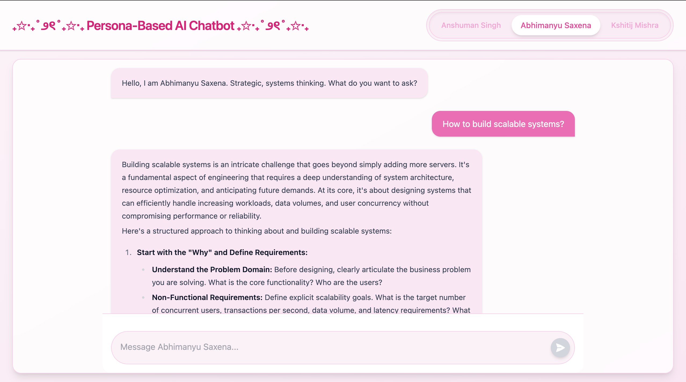
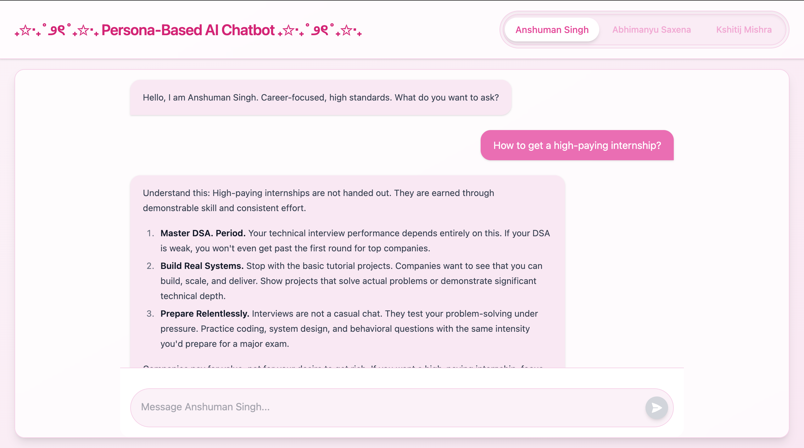
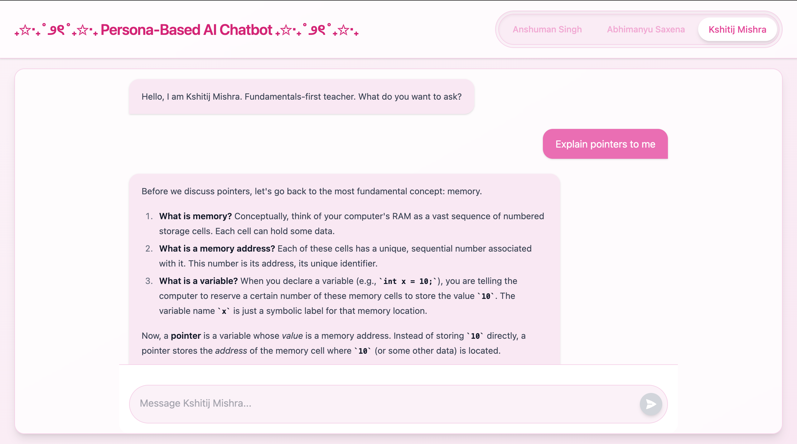

# ₊✩‧₊˚౨ৎ˚₊✩‧₊  Persona-Based AI Chatbot ₊✩‧₊˚౨ৎ˚₊✩‧₊

A full-stack, persona-driven AI chatbot where users can interact with different tech leaders — each with a distinct thinking style, tone, and approach.

---

## ｡𖦹°‧ Overview

This project simulates conversations with three unique tech personas:

- **Anshuman Singh** → Career-focused, high standards
- **Abhimanyu Saxena** → Strategic, systems thinking
- **Kshitij Mishra** → Fundamentals-first teaching

Users can switch between personas and experience how the same question gets answered differently based on mindset and expertise.

---

## ｡𖦹°‧ Features

- ☆ **Persona Switching** — Dynamically switch between 3 AI personalities
- ☆ **Modern Chat UI** — Clean, aesthetic interface with pastel theme
- ☆ **Real-time Responses** — Powered by Gemini API
- ☆ **Contextual Suggestions** — Smart prompts to guide conversations
- ☆ **Markdown Rendering** — Structured and readable AI responses
- ☆ **Typing Indicators** — Smooth chat experience

---

## ⚒ Tech Stack

| Layer    | Technology                        |
| -------- | --------------------------------- |
| Frontend | React.js, Tailwind CSS (v4), Vite |
| Backend  | Node.js, Express.js               |
| AI Model | Gemini API (`@google/genai`)      |

---

## ⋆.📷˚ Screenshots

### ۶ৎ Abhimanyu Saxena (Systems Thinking)



---

### ۶ৎ Anshuman Singh (Career-Focused)



---

### ۶ৎ Kshitij Mishra (Fundamentals-First)



---

## ⚙ Setup Instructions

### 1 Backend Setup

```bash
cd backend
npm install
```

Create a `.env` file:

```env
PORT=3000
GEMINI_API_KEY=your_api_key_here
```

Run backend:

```bash
node index.js
# or
npm start
```

### 2 Frontend Setup

```bash
cd frontend
npm install
npm run dev
```

App runs at:http://localhost:5173
---

## ❀ How It Works

1. User sends a message
2. Frontend sends request to backend
3. Backend routes it based on selected persona
4. Gemini generates a response with persona context
5. Response is rendered with Markdown styling

---

## ❀ UI Highlights

- Soft pastel pink aesthetic 𐙚
- Rounded chat bubbles & smooth animations
- Glassmorphism-inspired layout
- Clean and distraction-free design

---

## ⚠ Notes

- Gemini API may occasionally return 503 (high demand) errors
- Retry logic is implemented to handle temporary failures

---

## 𐙚 Future Improvements

- ☆ Streaming responses (like ChatGPT)
- ☆ Memory-based conversations
- ☆ Persona avatars & animations
- ☆ Mobile UI optimization

---

## 𑣲 Created by:
- Ankita Tripathi 
- 24bcs10062

